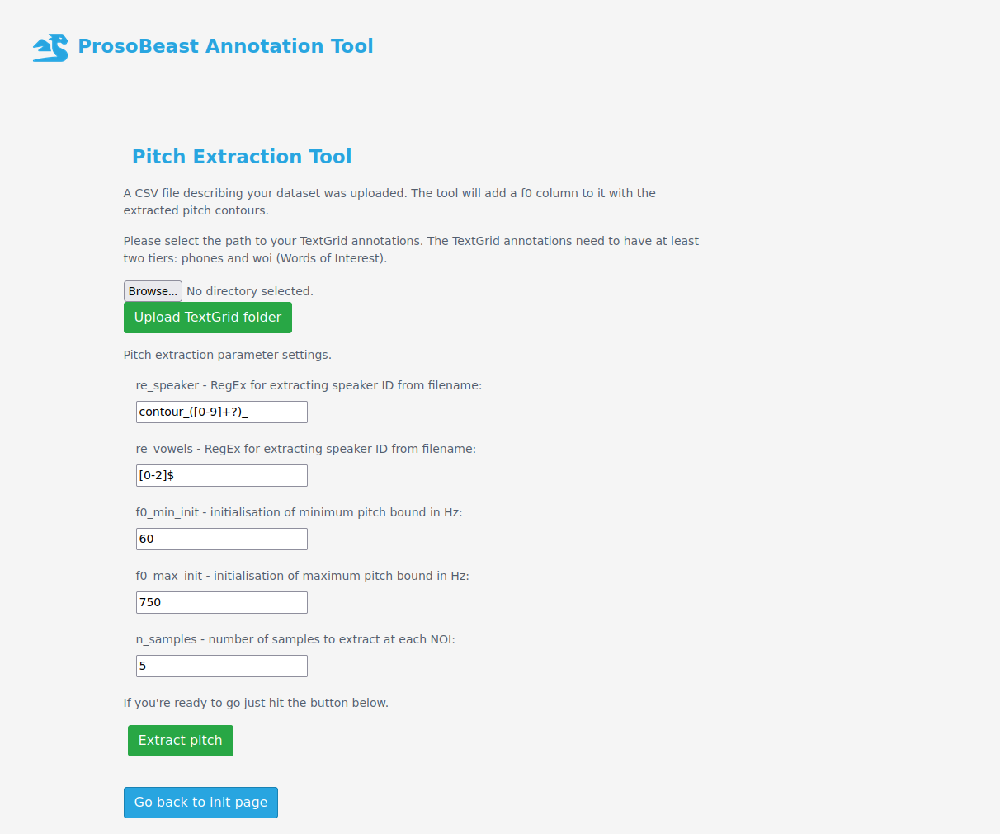

<h1 style="text-transform: capitalize; font-weight: bold; font-size: 23px; color: #28a5e0; text-indent: 10px;">
    
    
</h1>

**A web app for annotating prosody patterns based on Bokeh and Flask.**


The ProsoBeast Annotation Tool will allow you to view, compare, listen to, and ultimately annotate your speech prosody data using interactive visualisation. The tool runs in a browser on your `localhost`. It uses [Python's scientific ecosystem](https://scipy-lectures.org/) to load and process the data, [Bokeh](https://bokeh.pydata.org/) to visualise the data and render it in [D3.js](https://d3js.org/) for the web app that is based on the lightweight [Flask](https://flask.palletsprojects.com)  web application framework.

Watch the short video demo [here](https://www.youtube.com/embed/I7Wk5zTwbmY).


- [Install](#install)
- [Usage](#usage)
- [Prosody Extraction Tool](#prosody-extraction-tool)
- [Data Spread Calculation Tool](#data-spread-calculation-tool)
- [Sample Dataset](#sample-dataset)
- [References](#references)
- [Contributing](#contributing)
- [Credits](#credits)
- [License](#license)

<!-- tocstop -->

## Install

Follow these steps to get the tool going:

1. Download or clone this git repository:

```bash
git clone https://github.com/prosodylab/prosobeast-annotation-tool.git
```

2. Install the necessary dependencies for the Python code in a virtual environment of your choice (the built-in `venv` is used in this example):

```bash
cd prosobeast-annotation-tool  # navigate to folder
python3 -m venv venv  # create environment
source venv/bin/activate  # activate environment
pip install -r requirements.txt  # install dependencies
```

In order to use the integrated data spread calculation tool (see [Data Spread Calculation Tool](README.md#data-spread-calculation-tool) you need to additionally install:
- [scikit-learn](https://scikit-learn.org/stable/) - to calculate the PCA and t-SNE spreads:
```
pip install scikit-learn
```
- [PyTorch](https://pytorch.org/) for the VAE model training via: 
```
pip install pytorch
```
To have it run on your GPU you also need CUDA and `cudnn` on your system. It is highly recommended to install the PyTorch version appropriate to your CUDA version through their website!

3. Setup and run Flask on localhost:

```bash
export FLASK_APP=annotation_tool.py
flask run
```

This should output:

```bash
 * Serving Flask app "annotation_tool.py"
 * Environment: production
   WARNING: This is a development server. Do not use it in a production deployment.
   Use a production WSGI server instead.
 * Debug mode: off
 * Running on http://127.0.0.1:5000/ (Press CTRL+C to quit)
```

To use the tool simply navigate to your http://localhost:5000 (i.e. http://127.0.0.1:5000/)

## Usage

The tool should default to the initialisation screen.


Here you can upload your prosody data using a CSV file. The CSV file should contain the following list of columns:
- file - the name of the file in your corpus,
- info - any specifiers for the file you wish to be displayed on mouse hover in the interactive visualisation, e.g. the elicited contour type,
- label - the given label, it can be left empty in which case the tool assigns it a `No label`,
- location (optional) - the 2D location of the contour in the intonation space (see [Intonation Contour Distribution](README.md#intonation-contour-distribution)),
- f0 - a list of the F0 values to be plotted,
- dur - (optional) a list of the duration values that can be used in the
Prosody Extraction Tool.

To extract the duration and sample the F0 contours with the Prosody Extraction Tool via the master script `pitch_extract_tool/pitch_extract_master_script.py`.

Another CSV file is needed by the system that will specify the label choices you want to use for your data. 
This CSV file can optionally specify the color codes you want to use for your labels.
If color codes are not provided, the tool will automatically generate ones, fixing grey for the `No label` class.

The init screen also allows you to optionally upload an audio folder containing the files referenced in your CSV. 
This will allow playback of the audio files in the interactive visualisation.

## Prosody Extraction Tool

The annotation tool integrates a Prosody Extraction Tool.



The prosody extraction tool optionally takes as input a CSV file describing the database, 
the audio recordings and corresponding TextGrid annotations.

The CSV file has at least a column `file` containing the filenames.
Optionally it also includes `info` and `label` columns for use later in 
the annotation tool.

If the CSV file is not provided, one is created by the tool and populated with the names
of the audio files in the uploaded audio folder.

The TextGrid annotations need to have at least two tiers:
    1. phones - holding the phonetic transcription
    2. woi - marking the start and end times of the Words of Interest

The tool extracts the pitch values and durations from the Nuclei of Interest (NOI), defined as
the vowel regions in the WOIs.  Vowels are matched with a RegEx that is to be
provided by the user. In its default setting, the tool searches for phone transcriptions
that end with a numbered stress mark as used in CMUdict and [ARPABET](https://en.wikipedia.org/wiki/ARPABET).

It is important that the audio filenames contain a speaker ID to be used in the
pitch extraction process. The tool extracts the speaker IDs using a RegEx
provided by the user. The default settings is customized for the [sample dataset](#sample_dataset)
provided with the tool.

The pitch extraction process runs two iterations as suggested by [Hirst](https://uk.groups.yahoo.com/neo/groups/praat-users/conversations/topics/3472?guce_referrer=aHR0cDovL3d3dy5wcmFhdHZvY2FsdG9vbGtpdC5jb20vZXh0cmFjdC1waXRjaC5odG1s&guce_referrer_sig=AQAAAIDU5m6QVh0fVdsdE0b2etWRi49u3PKIN2BLKLWeuqlPrqXlo1Nn_TouJlGByEa361pcFeAnN6DWEbBvpd4ElCouJ0fD7eRiNz1-c_du6Psv3Gn4NXaCe62oQ8DCUa-HMspxd0d432ABbpukit0deIPiTc9Ba61WnenR24Kb66V2).
In the first iteration looser bounds on the minimum and maximum f0 are used.
These are then constricted based per speaker and a second iteration is run.
Pitch extraction is done using the [Kaldi](http://kaldi-asr.org/) Pitch Extractor.
At the end good pitch contours are selected based on the Probability of Voicing 
(POV) and they sampled at the vowel nuclei in the words of interest annotated 
in the `TextGrid` annotations.

More details as well as sample plots are given in the tool's
[README](./pitch_extract_tool/README.md).

## Data Spread Calculation Tool

The annotation tool integrates a data spread calculation tool.


The distribution of the contours in the *prosody space* can be calculated in various ways.
If your intonation vectors have fixed length, then you can use [PCA](https://scikit-learn.org/stable/modules/decomposition.html#pca) or even better [t-SNE](https://scikit-learn.org/stable/modules/manifold.html#t-sne).
For our analyses we use a more complex pipeline in which we first map out a *prosodic latent space* akin to the one defined in the [ProsoDeep project](https://gerazov.github.io/prosodeep/) and then do dimensionality reduction.
The integrated data spread calculation tool at the moment supports the following algorithms:
- PCA,
- t-SNE,
- VAE with a 2D latent space,
- VAE with a 4D latent space with a t-SNE dimensionality reduction to 2D.

The user is automatically redirected to the data spread calculation tool if no location data is provided in the user table. 
The tool can also be accessed from the main screen to add new data spreads for the data.
Using the durations in the calculation is optional.

## Sample Dataset

The tool can be tested via this sample dataset:

- Branislav Gerazov, Michael Wagner, "Pitch contours from subset of Intonational Bestiary," 2021, DOI: 10.5281/zenodo.4660054, Available: https://zenodo.org/record/4660054


The dataset comprises pitch contours extracted from a subset of the Intonational Bestiary dataset:

- M. Wagner and D. Goodhue, “Toward a bestiary of English intonational tunes: Data,” 2021, OSF Project. Available: https://doi.org/10.17605/OSF.IO/H8DYA

The pitch contours have been extracted in 2 iterations and have been sampled at 5 equidistant points in the nuclei of interest (NOI) of the stressed syllables of the content words in the carrier sentences. The pitch values for the 3 NOI and 4 NOI utterances are provided separately and together. The data includes labels given to the utterances by the annotators in the original data; a list of all the labels used is also provided. Audio files are provided for convenience.


## References

The tool is described in this paper:

- Branislav Gerazov and Michael Wagner, "ProsoBeast Prosody Annotation Tool," in Proceedings of Interspeech 2021, Aug 30 - Sep 3, Brno, Czechia, pp. 2621--2625, 2021. 

Paper available through [ISCA](https://www.isca-speech.org/archive/interspeech_2021/gerazov21_interspeech.html) and [arXiv](https://arxiv.org/abs/2104.02397).

To cite you can use:
```bibtex
@inproceedings{gerazov21prosobeast,
  author={Branislav Gerazov and Michael Wagner},
  title={{ProsoBeast Prosody Annotation Tool}},
  year=2021,
  booktitle={Proc. Interspeech 2021},
  pages={2621--2625},
  doi={10.21437/Interspeech.2021-304}
}

```


## Contributing

Any feature requests and bug reports can be submitted through the Issues tracker of this repository. Alternatively, fixes and enhancements can be submitted through Pull requests. Comments and contributions are welcome!


## Credits

The development of the ProsoBeast Annotation Tool has been carried out through the collaboration of the [Faculty of Electrical Engineering and Information Technologies](https://feit.ukim.edu.mk/en/), [Ss Cyril and Methodius University in Skopje](http://www.ukim.edu.mk/en_index.php), Macedonia and [prosody.lab](http://prosodylab.org/), at [McGill University](https://www.mcgill.ca/), Montreal, Canada. 
The design and implementation of the tool was funded by NSERC Grant RGPIN-2018-06153: *Three dimensions of sentence prosody* to the second author.


## License

The ProsoBeast Annotation Tool is licensed under the GNU GPL v.3, see the `LICENSE` file for details.
