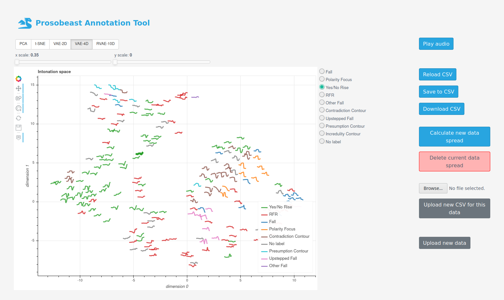
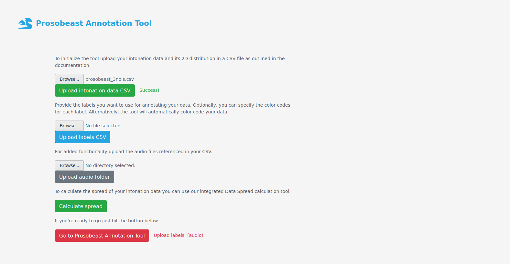
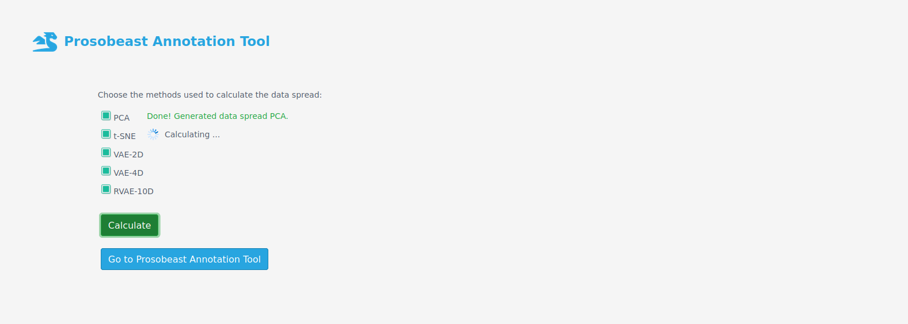

<h1 style="text-transform: capitalize; font-weight: bold; font-size: 23px; color: #28a5e0; text-indent: 10px;">
    
    
</h1>

A web app for annotating intonation patterns based on Bokeh and Flask.



The Prosobeast Annotation Tool will allow you to view, compare, listen to, and ultimately annotate your speech intonation data using interactive visualisation. The tool runs in a browser on your `localhost`. It uses [Python's scientific ecosystem](https://scipy-lectures.org/) to load and process the data, [Bokeh](https://bokeh.pydata.org/) to visualise the data and render it in [D3.js](https://d3js.org/) for the web app that is based on the lightweight [Flask](https://flask.palletsprojects.com)  web application framework.

There are currently two options for using the tool: using this git repository, or using a [Docker](https://www.docker.com/) container. Using the git version is a bit more involved, but will allow you to keep up to date with the latest code. The docker version should be easier to setup if your system is docker enabled.

A heavier deployment option for the tool based on Django is also available for setup on a server environment.

### Installing the Git version

Follow these steps to get the tool going:

1. Download or clone this git repository:

```bash
git clone https://github.com/gerazov/prosobeast-annotation-tool.git
```

2. Install the necessary dependencies for the Python code in a virtual environment of your choice (the built-in `venv` is used in this example):

```bash
cd prosobeast-annotation-tool  # navigate to folder
python3 -m venv venv  # create environment
source venv/bin/activate  # activate environment
pip install -r requirements.txt  # install dependencies
```

You need to have [scikit-learn](https://scikit-learn.org/stable/) installed to calculate the PCA and t-SNE spreads.
You can install it via:
```
pip install scikit-learn
```
In addition you need [PyTorch](https://pytorch.org/) for the VAE model training.
To have it run on your GPU you also need CUDA and cudnn on your system.
PyTorch can bee installed via:
```
pip install pytorch
```
However, it is recommended to find the version appropriate to your CUDA version through the PyTorch website.

3. Setup and run Flask on localhost:

```bash
export FLASK_APP=annotation_tool.py
flask run
```

This should output:

```bash
 * Serving Flask app "annotation_tool.py"
 * Environment: production
   WARNING: This is a development server. Do not use it in a production deployment.
   Use a production WSGI server instead.
 * Debug mode: off
 * Running on http://127.0.0.1:5000/ (Press CTRL+C to quit)
```

To use the tool simply navigate to your http://localhost:5000 (i.e. http://127.0.0.1:5000/)

### Installing the Docker image

...

### Usage

The tool should default to the initialisation screen.



Here you can upload your intonation data using a CSV file. The CSV file should contain the following list of columns:
- file - the name of the file in your corpus,
- info - any specifiers for the file you wish to be displayed on mouse hover in the interactive visualisation, e.g. the elicited contour type,
- label - the given label, it can be left empty in which case the tool assigns it a `No label`,
- location (optional) - the 2D location of the contour in the intonation space (see [Intonation Contour Distribution](README.md#intonation-contour-distribution)),
- f0 - a list of the $f_0$ values to be plotted.

Another CSV file is needed by the system that will specify the label choices you want to use for your data. 
This CSV file can optionally specify the color codes you want to use for your labels.
If color codes are not provided, the tool will automatically generate ones, fixing grey for the `No label` class.

The init screen also allows you to optionally upload an audio folder containing the files referenced in your CSV. 
This will allow playback of the audio files in the interactive visualisation.

### Intonation Contour Distribution

The annotation tool integrates a data spread calculation tool.



The distribution of the contours in the *intonation space* can be calculated in various ways.
If your intonation vectors have fixed length, then you can use [PCA](https://scikit-learn.org/stable/modules/decomposition.html#pca) or even better [t-SNE](https://scikit-learn.org/stable/modules/manifold.html#t-sne).
For our analyses we use a more complex pipeline in which we first map out a *prosodic latent space* akin to the one defined in the [ProsoDeep project](https://gerazov.github.io/prosodeep/) and then do dimensionality reduction.
The integrated data spread calculation tool at the moment supports the following algorithms:
- PCA,
- t-SNE,
- VAE with a 2D latent space,
- VAE with a 4D latent space with a t-SNE dimensionality reduction to 2D.

The user is automatically redirected to the data spread calculation tool if no location data is provided in the user table. 
The tool can also be accessed from the main screen to add new data spreads for the data.

### Contributing

Any feature requests and bug reports can be submitted through the Issues tracker of this repository. Alternatively, fixes and enhancements can be submitted through Pull requests. Comments and contributions are welcome!


### Credits

The development of the Prosobeast Annotation Tool has been fully funded by a research grant from [prosody.lab](http://prosodylab.org/), McGill University, Montreal, Canada

### License

The Prosobeast Annotation Tool is licensed under the GNU GPL v.3, see the `LICENSE` file for details.
