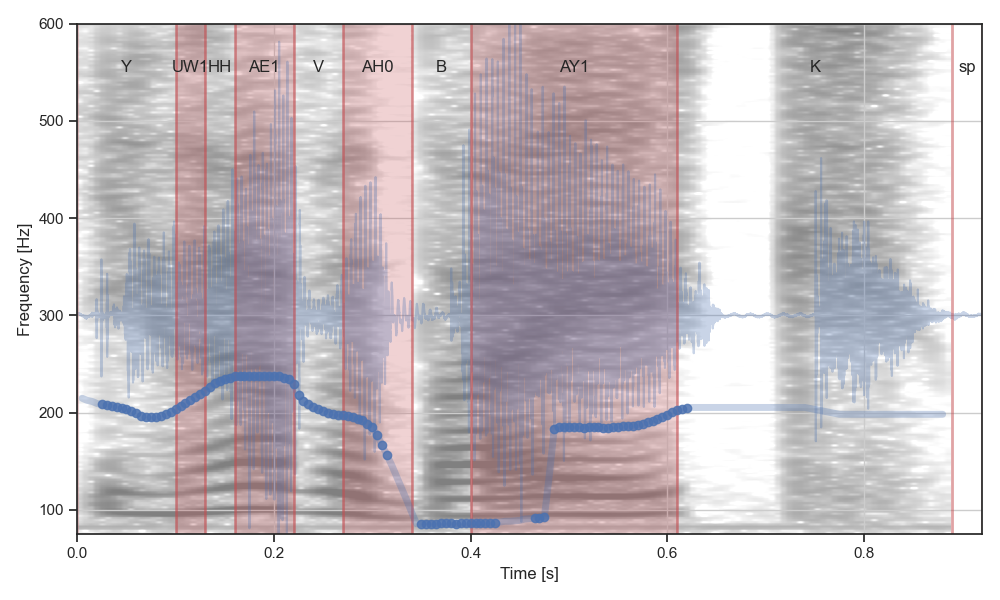
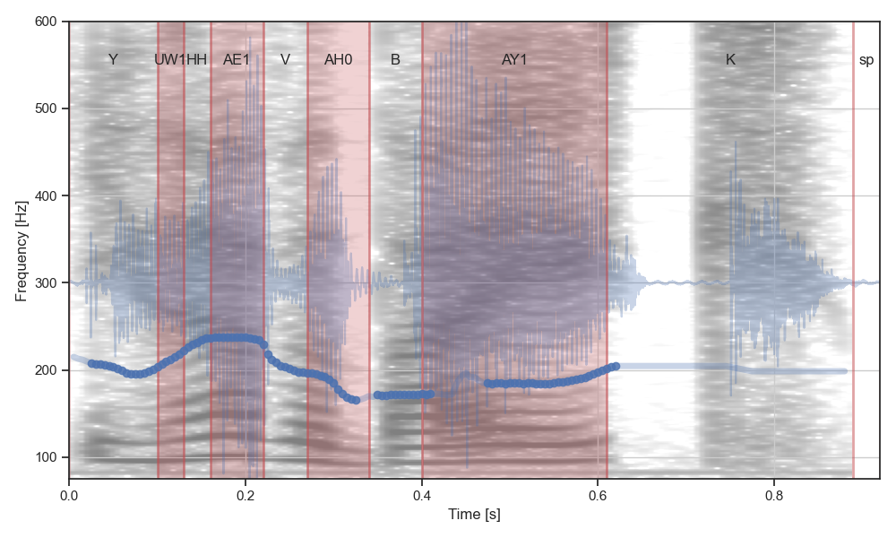
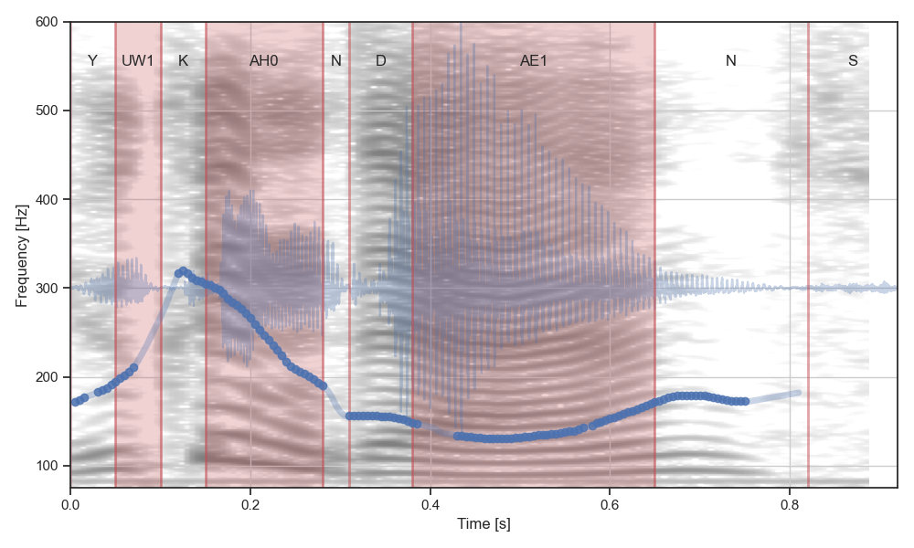
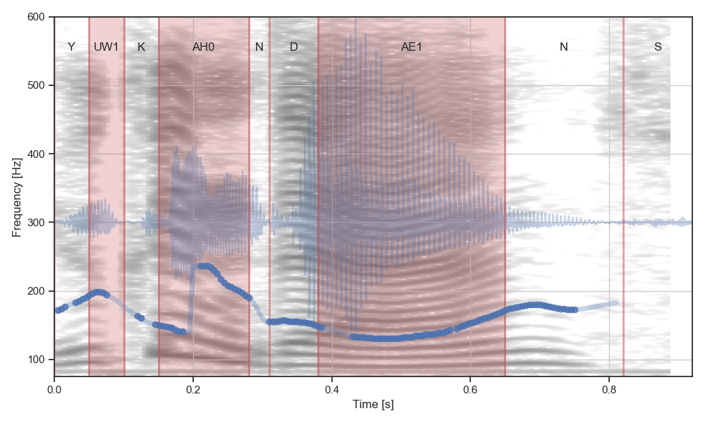
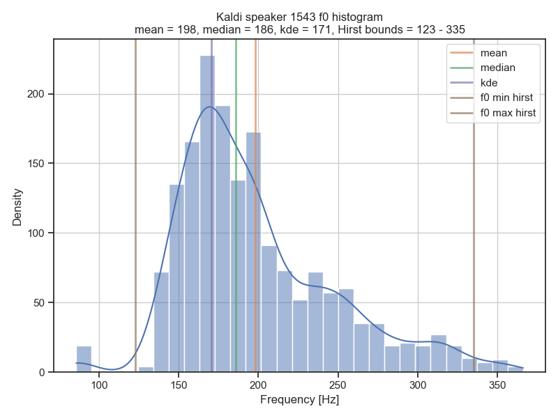
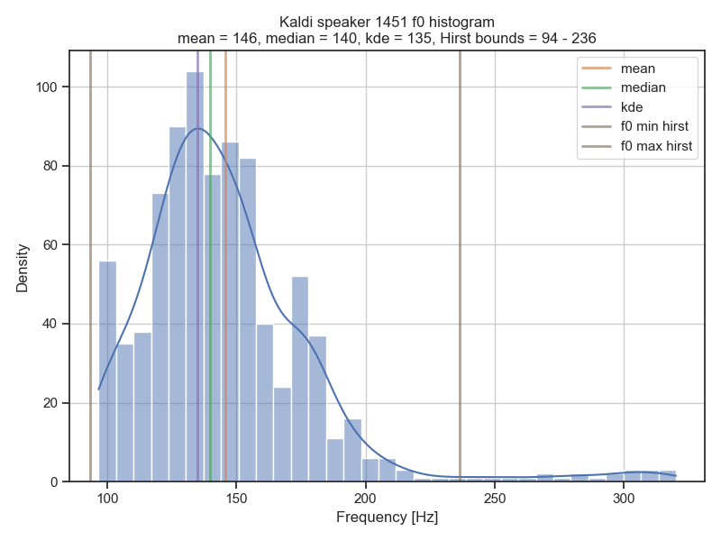
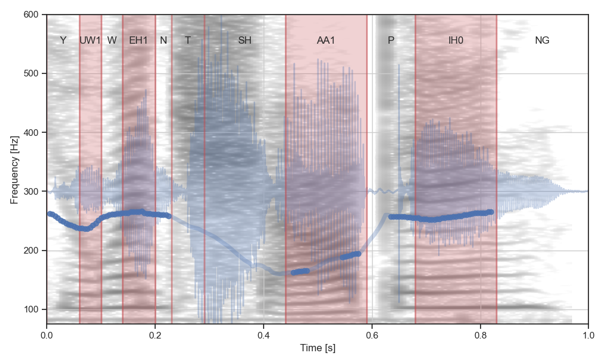
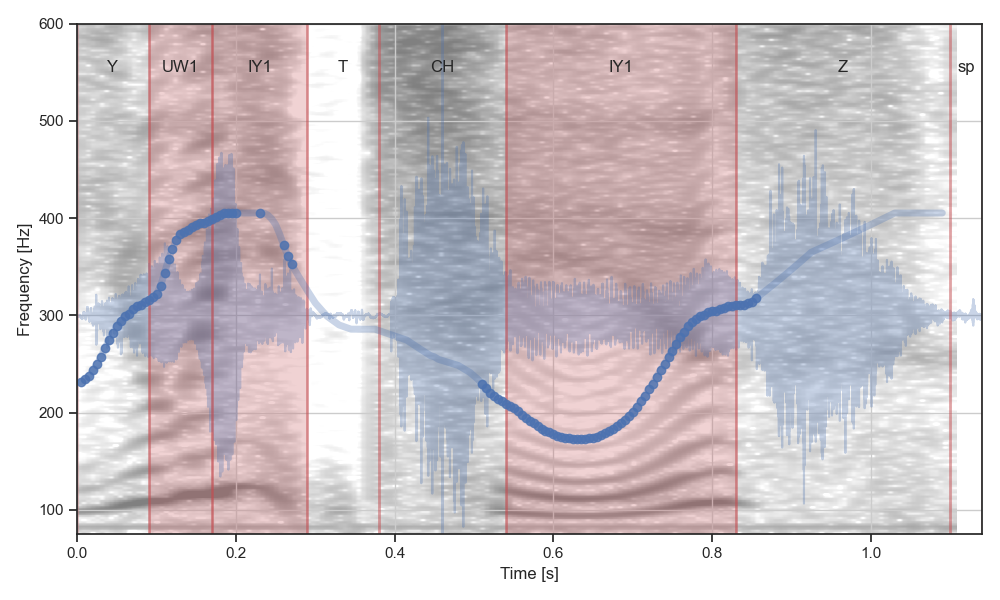
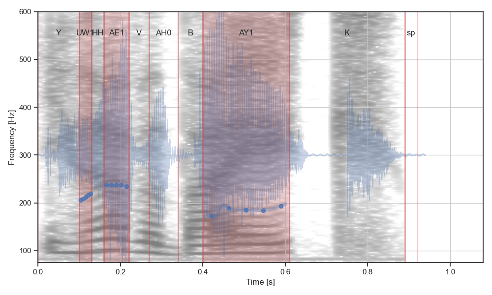
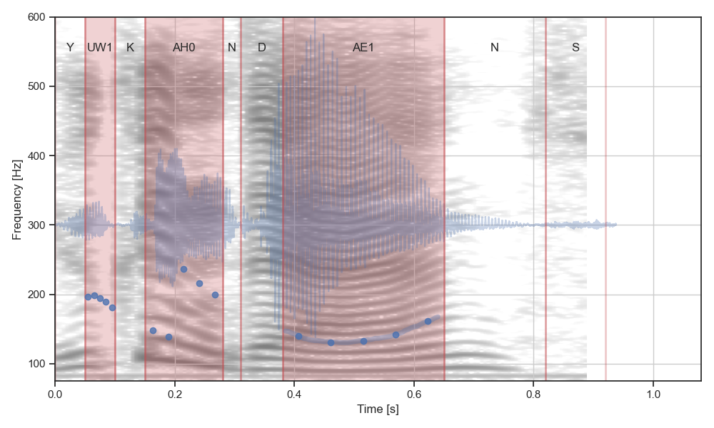

# Pitch extraction tool

Extract pitch using Kaldi pitch extractor and sample Regions of Interest using
`TextGrid` annotations.

The tool takes as input a `csv` file (optional), the audio files and `TextGrid`
annotations.

- The `csv` file has at least a column `file` with the filenames.
    Optionally it also includes columns `info` and `label` for use with
    the annotation tool.
    If the csv file is not found, one is created and populated with the names
    of the audio files in the path.
- The `TextGrid` annotations need to have at least two tiers:
    1. `phones`
    2. `woi` - i.e. Words of Interest

The tool extracts the pitch values from the Nuclei of Interest (NOIs), defined as
the vowel regions in the WOIs. Vowels are matched with a RegEx that can be
customized by the user. By default it's searching for a numbered stress mark at 
the end of the phone label as used in the CMUdict and [ARPABET](https://en.wikipedia.org/wiki/ARPABET).

The pitch is extracted in two passes in which the min and max pitch bounds are
recalculated from a more generous range to a more restrictive range based on Hirst's 
suggested [approach](#hirst-bounds).  Good contours are selected based on a percentage 
of the Probability of Voicing (POV) values in the NOIs being above the threshold.

## Code Structure

The script is split into the following code cells:

0. Init
1. Kaldi first pass
2. Calculate bounds
3. Kaldi second pass
4. Select good contours and sample

## Pitch Extraction

### Kaldi Pitch Extractor

To run the tool you need a compiled binary for the pitch tracker `compute-kaldi-pitch-feats` from [Kaldi](http://kaldi-asr.org/). It provides a continuous pitch estimate and a probability of voicing. Kaldi's code can be found [here](https://github.com/kaldi-asr/kaldi). For convenience we include a precompiled binary for a `x86_64 GNU/Linux` architecture.

### Hirst bounds

We use the min and max pitch bounds for each speaker to improve pitch extraction. Hirst suggests the following [approach](https://uk.groups.yahoo.com/neo/groups/praat-users/conversations/topics/3472?guce_referrer=aHR0cDovL3d3dy5wcmFhdHZvY2FsdG9vbGtpdC5jb20vZXh0cmFjdC1waXRjaC5odG1s&guce_referrer_sig=AQAAAIDU5m6QVh0fVdsdE0b2etWRi49u3PKIN2BLKLWeuqlPrqXlo1Nn_TouJlGByEa361pcFeAnN6DWEbBvpd4ElCouJ0fD7eRiNz1-c_du6Psv3Gn4NXaCe62oQ8DCUa-HMspxd0d432ABbpukit0deIPiTc9Ba61WnenR24Kb66V2):

> We have found that a good approach is to do pitch detection in two steps. In the first step you use standard parameters and then from the distribution of pitch values, you get the 1st and 3rd quartile which we have found are quite well correlated with the minimum and maximum pitch, and finally use the estimated min and max for a second pitch detection. This avoids a considerable number of octave errors which are frequently found when using the standard arguments.

The implementation is in the function `get_hirst_bounds()` in
`pitch_extract_utils.py`. Hirst suggests using the range 60 - 750 Hz for the first pass, but this can be tweaked to improve the results.

### Plots

The script outputs plots from all the pitch contours extracted in the 1st and 2nd pass in the same directory specified by `f0_plot_path`. The naming is such that one can easily compare the two passes and see if things improved or not.

In addition pitch histograms are plot for each speaker in the dataset in `hirst_plot_path`. These include the calculated bounds that are used in the 2nd pass.

The pitch of the selected utterances are plot in `good_plot_path`.

## Sample Results

The results here have been obtained when running the Pitch Extract Tool on the sample dataset provided with the ProsoBeast Annotation Tool, assuming a:

- POV threshold of 0.2,
- POV percentage threshold of 0.5,
- minimum pitch for the initial pass of 75 Hz,
- maximum pitch for the initial pass of 600 Hz.

The utterances shown in the sample plots and their TextGrids are also included
in the folder `./sample_data`

### Two pass f0

The pitch contours are improved in the 2nd pass in general, e.g. for `contour_1543_9_3` we get:

- First pass


- Second pass


But it does degrade others, e.g. `contour_1451_8_1`:

- First pass


- Second pass

    
### Histograms

The histograms for these two speakers above - `1543` and `1451` are:

- Speaker `1543`


- Speaker `1451`


### Contour selection

The selection process will discard the following two contours:

```
 44%|██████████████████████▌                            | 133/300 [00:43<00:49,  3.37it/s]
> contour_1645_5_2 did not pass pov check NOI 2 perc 0.4642857142857143

 47%|████████████████████████▏                          | 142/300 [00:45<00:50,  3.12it/s]
> contour_1646_4_1 did not pass pov check NOI 1 perc 0.45454545454545453

100%|███████████████████████████████████████████████████| 300/300 [01:35<00:00,  3.13it/s]
```

- `contour_1645_5_2`


- `contour_1646_4_1`


### Contour sampling 

The sampled pitch contours from above will look like:

- Sampled contour `1543_9_3`


- Sampled contour `1451_8_1`



## Notes

Some of the code is taken from previous work on [ProsoDeep](https://github.com/gerazov/prosodeep).

